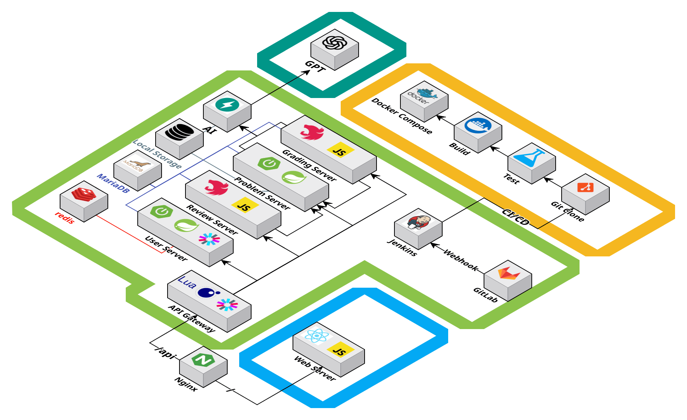
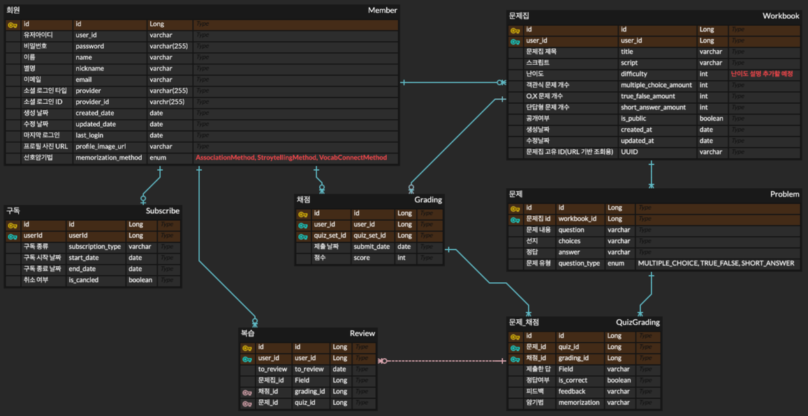

# 🐿️ Learn & Memorize Intelligence (LAMI)

### AI 학습 도우미 플랫폼

## 📜 목차 

1. 프로젝트 일정
2. 프로젝트 개요
3. 서비스 소개
4. 주요 기능
5. 기술 스택
6. 산출물
7. 팀원 소개

## 🗓️ 프로젝트 일정

- 일정: 2025년 4월 3일 ~ 6월 12일 (10주)

## 🔎 프로젝트 개요

아래 내용은 수정 필요 \
{{{1. 기존 학습 플랫폼의 한계
- 기존의 온라인 학습 플랫폼은 주로 일반적인 콘텐츠 제공에 그치며 학습 스타일, 이해도, 기억 전략 등을 충분히 반영하지 못함
- 맥킨지 앤드 컴퍼니의 2021년 조사에 따르면, 학습자들은 더 맞춤화된 학습 경험을 원하고 있으며, 기존 플랫폼의 한계가 학습 효율성을 저하시키는 요인으로 지적
2. LLM 시장의 활성화
- Grand View Research, 2024년 시장 규모는 약 56억 달러로, 2025년부터 2030년까지 CAGR 36.9%로 성장할 것으로 보입니다
- 한국 정부의 2025년까지 1만 개의 고성능 GPU를 확보하여 국가 AI 컴퓨팅 센터를 설립할 계획을 발표
- 한국의 AI 시장 2024년 31억 2천만 달러로 평가, 2033년까지 300억 달러에 이를 것으로 예상.
- 한국의 외국 AI 기술, 특히 OpenAI의 ChatGPT에 대한 의존도를 줄이기 위한 노력으로 국내 LLM 개발이 가속화
- 마이크로소프트, 애플, 엔비디아 등이 투자자로 오픈AI는 1500억 달러(약 200조원) 기업가치로 투자를 유치중
}}}

## 🔎 서비스 소개

- PDF/스크립트 기반 문제 생성
- 생성한 문제를 공유하고 풀이 가능
- 자동 채점 및 오답 피드백 + 암기법 제공
- 복습 카테고리 추가로 주기적 리마인드 제공

## 🔎 주요 기능

- 문제집 생성: 
- 문제 공유:
- 문제 풀기:
- 피드백 및 암기법 제공:
- 리마인드 할 문제를 복습 기능에 추가

## ⚒️ 기술 스택

- **Frontend**

  
  
  
  
  
  
  
  
  

- **Backend**

  
  
  
  
  
  
- **Infra**

  
  
  

- **Database**

  
  

- **Tool**

  
  

## 📜 산출물

아키텍쳐 구조도
  

ERD

## 🖥️ 주요 기능 화면

[프론트 엔드 화면들이 작동하는 것을 GIF로 나열하면 좋을 거 같음!]

## 팀원 소개

<table>
  <tr>
    <td align="center">
       
      <b>김민주</b> 
      <i>Backend</i>
    </td>
    <td align="center">
       
      <b>채철영</b> 
      <i>Backend</i>
    </td>
    <td align="center">
       
      <b>송민서</b> 
      <i>Backend, Infra</i>
    </td>
    <td align="center">
       
      <b>박준걸</b> 
      <i>Backend, Infra</i>
    </td>
    <td align="center">
       
      <b>채승오</b> 
      <i>Backend</i>
    </td>
  </tr>
</table>